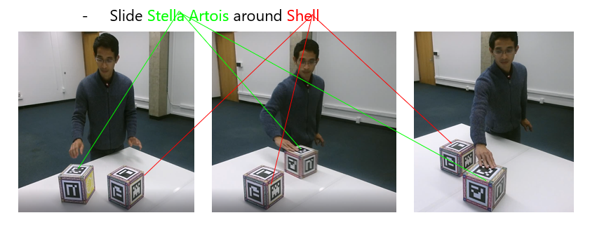
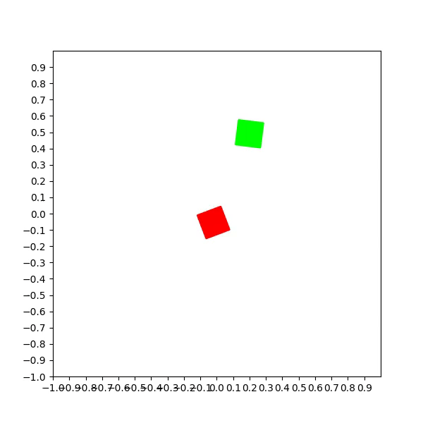
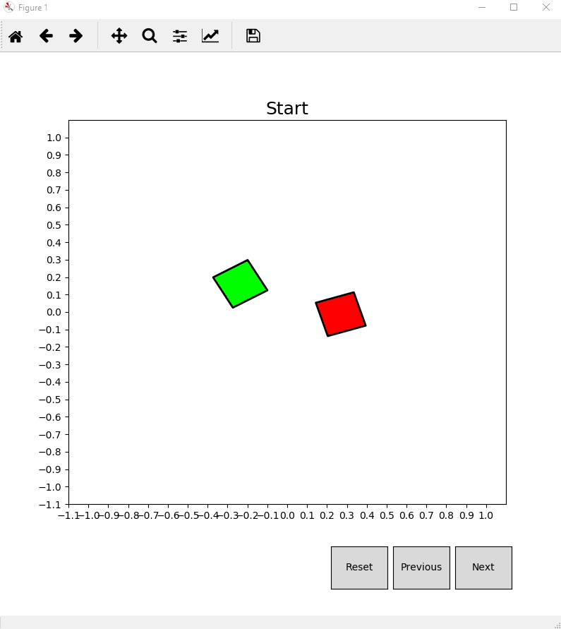

# Teaching simulated agents to perform complex spatial-temporal activities

## Abstract

we introduce a framework in which computers learn to enact complex temporal-spatial actions by observing humans. Our framework processes  motion capture data of human subjects performing actions, and uses qualitative spatial reasoning to learn multi-level representations for
these actions. Using reinforcement learning, these observed sequences are used to guide a simulated agent to perform novel actions. To evaluate, we visualize the action being performed in an embodied 3D simulation environment, which allows evaluators to judge whether the system has successfully learned the novel concepts. This approach complements other planning approaches in robotics and demonstrates a method of teaching a robotic or virtual agent to understand predicate-level distinctions in novel concepts.

## Content

This is a project to demonstrate the idea that we can teach robots to execute certain complex actions by allowing them to observe human experts to perform the same actions a number of times, and using planning with reinforcement learning methods to simulate the action.

This is our paper at [AAAI Spring Symposium 2018](https://www.researchgate.net/profile/Tuan_Do14/publication/322836314_Teaching_Virtual_Agents_to_Perform_Complex_Spatial-Temporal_Activities/links/5a724463458515512075e396/Teaching-Virtual-Agents-to-Perform-Complex-Spatial-Temporal-Activities.pdf). 

You can find our presentation at AAAI Spring Symposium 2018 [here](miscellanous/AAAI-SS-2018-jp-edits.pptx).

In summary, we want to translate from observing recorded human demonstrations, and from descriptions of actions to executable plan for virtual agents to perform. 

For example, from inputs:



To output:




## Install

My code requires installation of tensorflow, and optionally keras. I use Anaconda python 3.6.2 distribution. Installation of Tensorflow can be found [here](https://www.tensorflow.org/install/) (tested with Tensorflow 1.2.1, but higher version should also work). Other required library could be installed as followings:

```
conda install -c anaconda html5lib

pip install gym==0.9.4

pip install matplotlib

pip install scipy

pip install pandas

pip install pyyaml
```

## Try it

### Interactive API

Run the following interactive API:

```
Test greedy interactive API.

optional arguments:
  -h, --help            show this help message and exit
  -a ACTION, --action ACTION
                        Action type. Choose from 'SlideToward', 'SlideAway',
                        'SlideNext', 'SlidePast', 'SlideAround'
  -p PROGRESS, --progress PROGRESS
                        Path of progress file. Default is
                        'learned_models/progress_' + action + '.mod.updated'
  -d DISCRETE, --discrete DISCRETE
                        Whether it is discrete greedy search. Default is False

python action_learner_interactive.py
```



### Interactive-feedback API

```
usage: action_learner_interactive_hot.py [-h] [-a ACTION] [-p PROGRESS]
                                         [-s SAVE]

Test greedy interactive API with immediate update.

optional arguments:
  -h, --help            show this help message and exit
  -a ACTION, --action ACTION
                        Action type. Choose from 'SlideToward', 'SlideAway',
                        'SlideNext', 'SlidePast', 'SlideAround'
  -p PROGRESS, --progress PROGRESS
                        Path of progress file. Default is
                        'learned_models/progress_' + action + '.mod.updated'
  -s SAVE, --save SAVE  Where to save updated progress file.


```


### Testing a model

Test greedy algorithms with SlideAround action on progress model learned_models/progress_SlideAround.mod.updated, using first 30 setups stored in data/stored_envs_2.dat


```
usage: test_all_searcher.py [-h] [-a ACTION] [-n SIZE] [-l ALGORITHM]
                            [-p PROGRESS] [-s SETUP]

Test searcher.

optional arguments:
  -h, --help            show this help message and exit
  -a ACTION, --action ACTION
                        Action type. Choose from 'SlideToward', 'SlideAway',
                        'SlideNext', 'SlidePast', 'SlideAround'
  -n SIZE, --size SIZE  Number of configurations
  -l ALGORITHM, --algorithm ALGORITHM
                        Choose one of the followings: ALL, GREEDY, BACKUP,
                        CONTINUOUS, DISCRETE. Default is ALL
  -p PROGRESS, --progress PROGRESS
                        Path of progress file. Default is
                        'learned_models/progress_' + project_name + '.mod'
  -s SETUP, --setup SETUP
                        Path to setup file. Default is 'data/stored_envs_1.dat
                        (first set)

python test_all_searcher.py -a SlideAround -p learned_models/progress_SlideAround.mod.updated -s data/stored_envs_2.dat -n 30 -l GREEDY
```

### Running gradient policy algorithms (on discrete space)

```
usage: discrete_action_learner_test.py [-h] [-e EPISODE] [-m MODEL]
                                       [-b BREADTH] [-p PROGRESS_STATE]
                                       [-f PROGRESS]

Test discrete action learner.

optional arguments:
  -h, --help            show this help message and exit
  -e EPISODE, --episode EPISODE
                        Number of episodes.
  -m MODEL, --model MODEL
                        Model type. Choose ACTOR_CRITIC or REINFORCE. Default
                        is ACTOR_CRITIC
  -b BREADTH, --breadth BREADTH
                        Breadth. Number of actions generated at each step.
                        Default is 1
  -p PROGRESS_STATE, --progress_state PROGRESS_STATE
                        Whether to keep progress as state component. Default
                        is True.
  -f PROGRESS, --progress PROGRESS
                        Path of progress file. Default is
                        'learned_models/progress_' + project_name + '.mod'

python discrete_action_learner_test.py -e 2000 -m ACTOR_CRITIC -b 1 -p False -f learned_models/progress_SlideAround.mod.updated
```